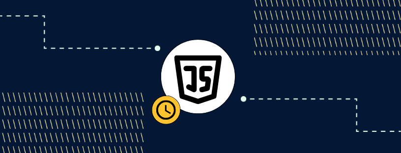

# 1. Pengenalan JavaScript



<small>https://www.codingtemple.com/blog/how-long-does-it-take-to-learn-javascript</small>

## Apa itu JavaScript?

JavaScript adalah bahasa pemrograman yang digunakan terutama untuk pengembangan web. Bahasa ini memungkinkan pengembang untuk membuat halaman web yang interaktif dan dinamis. Dengan JavaScript, elemen-elemen pada halaman web dapat berinteraksi dengan pengguna melalui berbagai cara, seperti menangani klik tombol, validasi formulir, dan animasi. JavaScript dapat dijalankan di sisi client (browser) maupun di sisi server (Node.js), menjadikannya bahasa yang serbaguna dan penting dalam ekosistem pengembangan web modern.

## Sejarah JavaScript

JavaScript pertama kali dikembangkan oleh Brendan Eich pada tahun 1995 saat bekerja di Netscape Communications Corporation. Awalnya, bahasa ini disebut Mocha, kemudian berganti nama menjadi LiveScript, dan akhirnya dinamakan JavaScript. Nama JavaScript dipilih untuk memanfaatkan popularitas bahasa pemrograman Java pada saat itu, meskipun kedua bahasa ini tidak memiliki hubungan langsung. JavaScript menjadi populer karena kemampuannya untuk meningkatkan interaktivitas halaman web, memungkinkan pengembang untuk membuat pengalaman pengguna yang lebih kaya dan responsif.

## Versi JavaScript

JavaScript terus berkembang dengan berbagai versi yang dirilis oleh ECMA International. Setiap versi baru membawa peningkatan dan fitur baru yang membuat bahasa ini lebih kuat dan mudah digunakan. Beberapa versi penting termasuk:

-  **ECMAScript 3 (1999)**: Versi pertama yang diadopsi secara luas, memperkenalkan banyak fitur dasar yang masih digunakan hingga saat ini.
-  **ECMAScript 5 (2009)**: Menambahkan fitur seperti strict mode, yang membantu pengembang menulis kode yang lebih aman dan andal, serta JSON parsing, yang memudahkan manipulasi data dalam format JSON.
-  **ECMAScript 6 (2015)**: Juga dikenal sebagai ES6 atau ECMAScript 2015, memperkenalkan banyak fitur baru seperti let dan const untuk deklarasi variabel, arrow functions untuk penulisan fungsi yang lebih singkat, dan class untuk mendefinisikan objek dengan cara yang lebih mirip dengan bahasa pemrograman berorientasi objek lainnya.

## Cara Menjalankan JavaScript

Ada beberapa cara untuk menjalankan JavaScript, baik di sisi client maupun di sisi server:

1. **Di Browser**: JavaScript dapat dijalankan langsung di browser dengan menyisipkan kode JavaScript ke dalam elemen `<script>` di file HTML. Ini memungkinkan pengembang untuk menambahkan interaktivitas langsung ke halaman web.

   ```html
   <!DOCTYPE html>
   <html>
      <head>
         <title>Contoh JavaScript</title>
      </head>
      <body>
         <h1>Halo, Dunia!</h1>
         <script>
            console.log("Halo, Dunia!");
         </script>
      </body>
   </html>
   ```

   Dalam contoh di atas, kode JavaScript yang berada di dalam elemen `<script>` akan dijalankan oleh browser ketika halaman dimuat, dan pesan "Halo, Dunia!" akan ditampilkan di konsol.

2. **Menggunakan Node.js**: JavaScript juga dapat dijalankan di sisi server menggunakan Node.js, sebuah lingkungan runtime yang memungkinkan eksekusi JavaScript di luar browser. Untuk menjalankan JavaScript dengan Node.js, pertama-tama instal Node.js, kemudian buat file JavaScript dan jalankan menggunakan perintah `node`.
   ```javascript
   // simpan sebagai hello.js
   console.log("Halo, Dunia!");
   ```
   Jalankan dengan perintah:
   ```bash
   node hello.js
   ```
   Dalam contoh ini, Node.js akan mengeksekusi file `hello.js` dan menampilkan pesan "Halo, Dunia!" di terminal atau command prompt.
